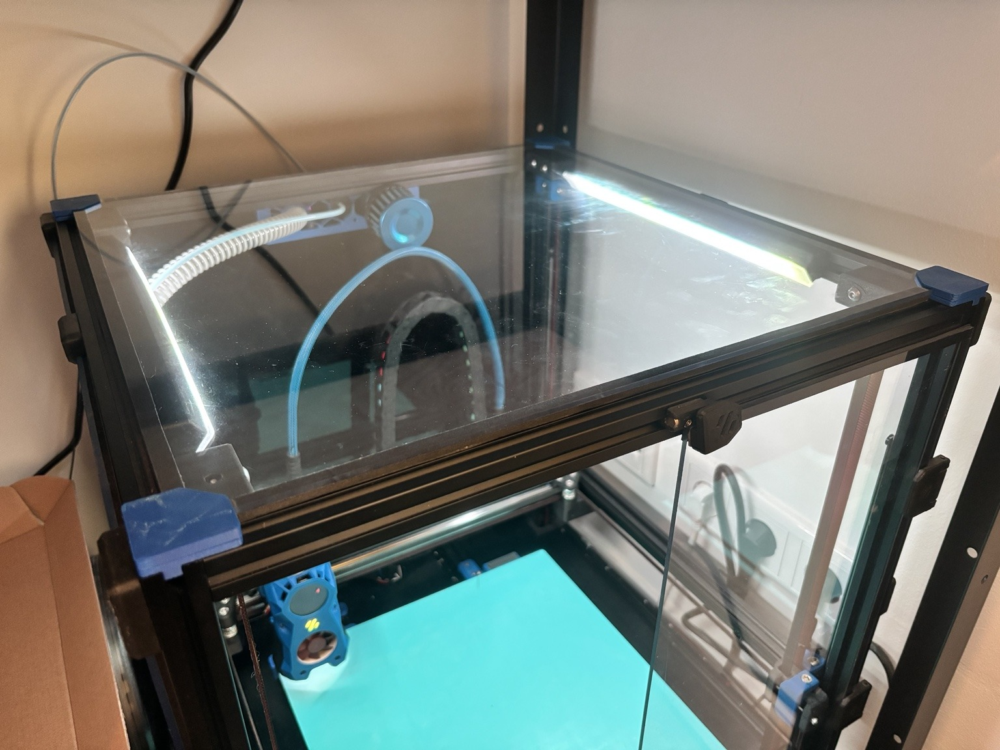
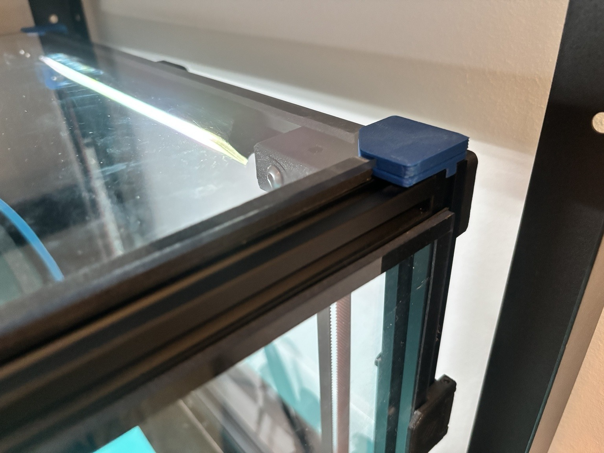
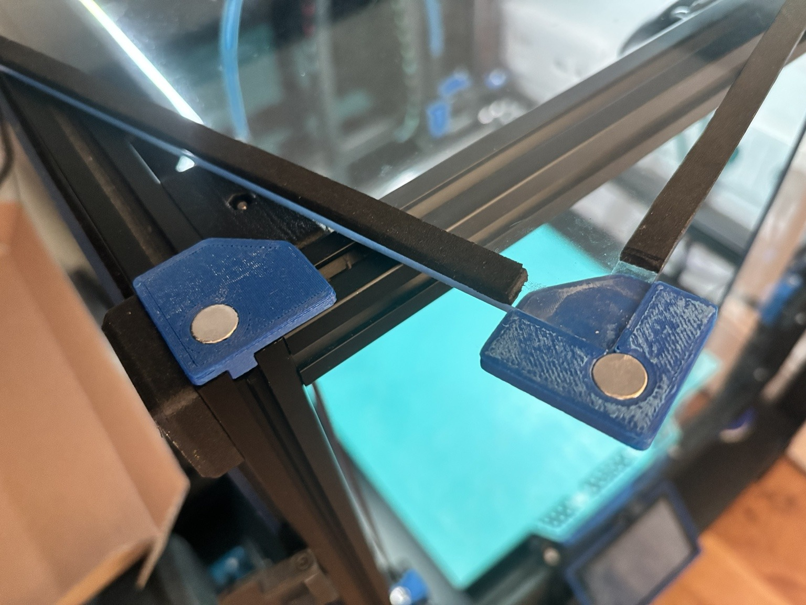

# Magnetic Top Panel - Small Panel Variant

A Voron 2.4 top-panel corner system for **smaller 3 mm polycarbonate panels**. It is based on Printopal's [Magnetic top panel](https://github.com/VoronDesign/VoronUsers/tree/main/printer_mods/Printopal/Magnetic_top_panel), but moves the magnet holes from beneath the top panel to accommodate for panels smaller than intended for the original design.

## Why this variant exists

The original magnetic-top-panel design places the upper magnet carrier underneath the panel. The foam tape had to compensate for the thickness of the upper and lower corner pieces combined. With moving the magnets from beneath the panel, the top corner piece can sit flush with the bottom of the top panel and the foam tape only has to compensate for the 3mm of the bottom corner piece.

This variant changes the geometry in a functional way:

- the **frame magnet is moved to the center of the four extrusion locating features**;
- the panel-side corner is **reversed into a top cap**;
- the cap sits on top of a **3.0 mm PC panel**, with a 1.0 mm roof and a 3.0 mm drop beside the panel;
- the magnet sits immediately outside the panel corner, so there is no magnet carrier trapped underneath the sheet;
- larger **10 x 3 mm magnets** are used for a firm, positive hold.

## Tested dimensions

This exact STL set was physically tested on a Voron 2.4 with:

| Parameter | Value |
|---|---:|
| Top panel | 434 x 434 mm |
| Panel thickness | 3.0 mm |
| Upward-extrusion center spacing | 441 x 441 mm |
| Panel inset per side | 3.5 mm |
| Magnets | 10 x 3 mm |
| Magnet pocket | 10.1 mm diameter x 3.0 mm |

The inset is simply:

`inset = (extrusion-center spacing - panel dimension) / 2`

For the tested build: `(441 - 434) / 2 = 3.5 mm`.

The supplied parametric OpenSCAD source exposes the X/Y panel and frame dimensions independently if your panel is different.

## BOM

- 4x `frame_corner_10x3`
- 4x `panel_corner_top_cap_10x3`
- 8x neodymium magnets, **10 mm diameter x 3 mm thick**
- Existing 3 mm top panel
- Any type of functional adhesive

## Printing

Recommended: **ABS or ASA**, 100% scale, standard Voron structural-part settings. No supports are required with the supplied STL orientations.

- `frame_corner_10x3_x4.stl`: print base-down as supplied.
- `[a]_panel_corner_top_cap_10x3_x4.stl`: supplied **roof-down**, so the 1 mm top face is on the build plate and the recess prints upward.
- The model does not need to be scaled up in compensation for shrinkage in my experience

## Assembly

1. Print four of each part.
2. If the surfaces of your print are not perfectly smooth, you can sand them for a more flush fit when installed.
3. Dry-fit all eight 10 x 3 mm magnets before bonding anything.
4. Glue the magnets into the bottom corner pieces first. Once they are set you can just attach a magnet on top and press the top corner piece    onto the extra magnet to press fit it, no glue required.
6. Install the four frame corner pairs by pressing the bottom corner piece into the upwards facing extrusions and check if your panel fits       inside them.
7. Then glue each top corner to the upper side of the top panel.
8. Place the panel on the printer; the magnets align over the frame corners automatically.
9. If there is a small gap between the foam tape on the top panel and the frame, you can just put a 1mm foam tape strip on top of the 3mm one    to get a better seal

## CAD / adapting to another panel

`CAD/panel_corner_top_cap_10x3_parametric.scad` contains variables for:

- panel width/depth;
- extrusion-center spacing X/Y;
- panel thickness;
- roof thickness;
- magnet diameter and clearance.

The default values reproduce the physically tested 434/441 mm version. STEP exports of the final tested geometry are also included.

## Attribution and license

This is a derivative of **Printopal's Magnetic top panel** from the VoronUsers repository. The original geometry, concept, and accepted upstream mod are credited to Printopal.

The changes in this variant were developed around an undersized-panel fit problem and physically tested on a Voron 2.4. This derivative is released under **GPL-3.0**, consistent with the upstream VoronUsers repository and original mod.
